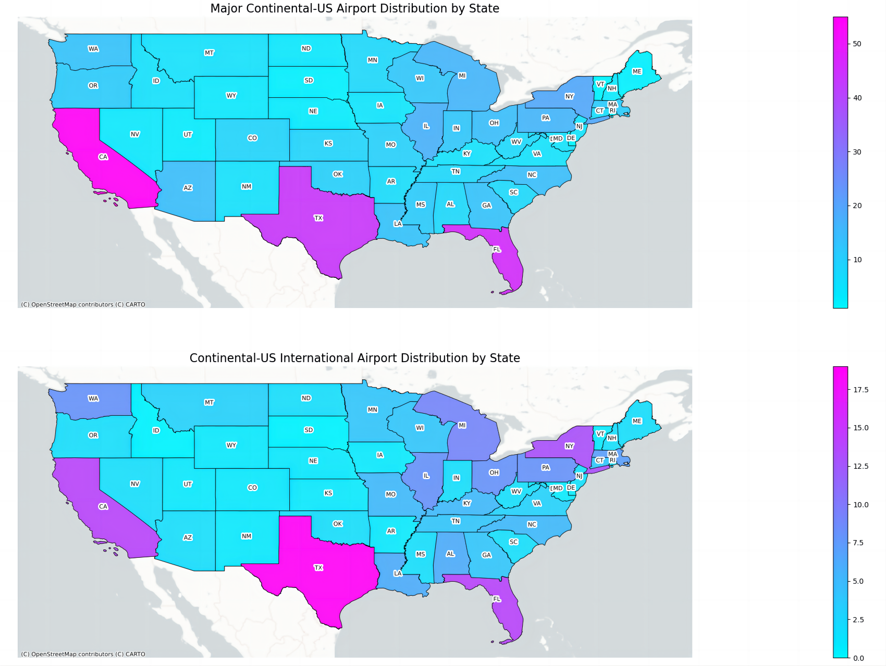
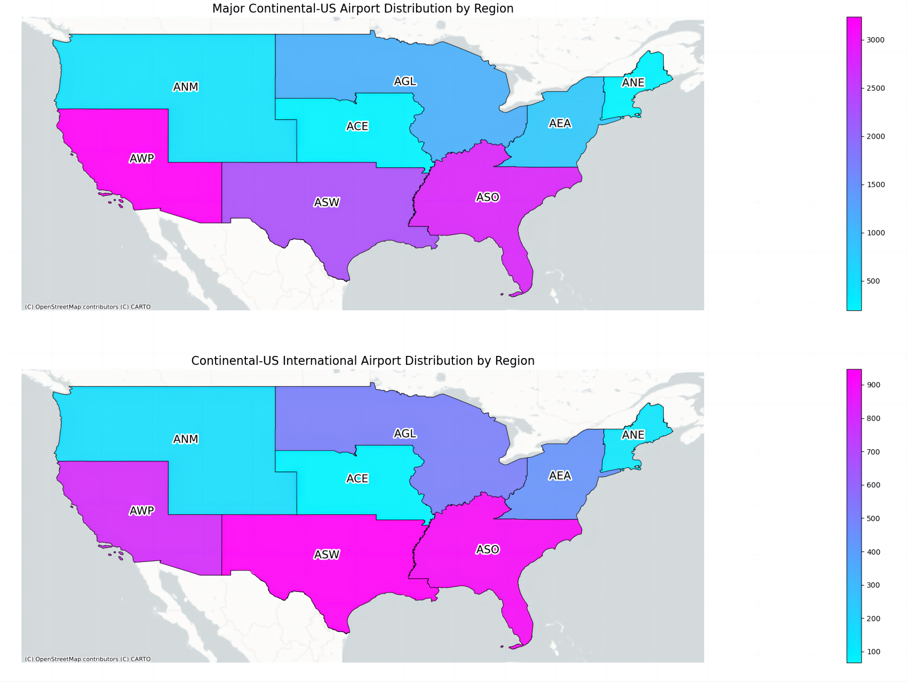
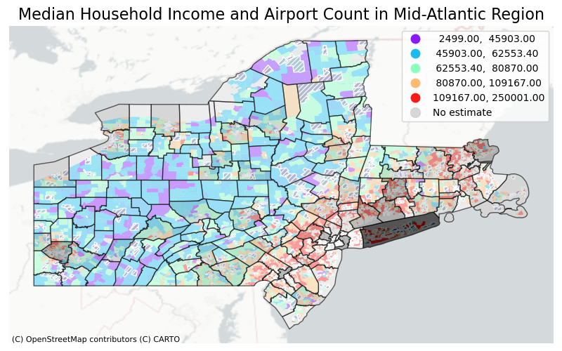

# GIS Final Project: Airport Distribution and Median Household Income Relationship

## DataSet Introduction
This project includes   
1. The Airports dataset containing all official and operational aerodromes as of July 16, 2020.
   - Prepared by: US Department of Transportation-Bureau of Transportation Statistics
   - Format: geojson
   - Last Updated: November 15, 2022
   - URL:[https://data.bts.gov/Aviation/Airports/kfcv-nyy3](https://data.bts.gov/Aviation/Airports/kfcv-nyy3)
2. The US County Boundaries dataset
   - Prepared by: US Census Bureau
   - Format: geojson
   - Last Updated: November 2, 2020
   - URL:[https://public.opendatasoft.com/explore/dataset/us-county-boundaries/information/?disjunctive.statefp&disjunctive.countyfp&disjunctive.name&disjunctive.namelsad&disjunctive.stusab&disjunctive.state_name](https://public.opendatasoft.com/explore/dataset/us-county-boundaries/information/?disjunctive.statefp&disjunctive.countyfp&disjunctive.name&disjunctive.namelsad&disjunctive.stusab&disjunctive.state_name)
3. The Cencus Dataset
   - Prepared by: US Census Bureau
   - Format: zip
   - Last Updated: August, 9, 2019
   - URL:[https://www2.census.gov/geo/tiger/TIGER2019/TRACT](https://www2.census.gov/geo/tiger/TIGER2019/TRACT)

I used table join, spatial join, aggregation to subset data tables to reasonable sizes. Airport dataset has too many columns and plenty of null values. 

## Interactive Map: Continental-US Airport Distribution
The following interactive map shows the distribution of the major airports in Continental-US. Markers represent international airports(with international custom facilities). In the Midatlantic Region, I aggregated number of airports by county. The darker of the county is colored, the more airports it has.    

Highlight Features:    
1. Carto Positron and openstreetmap layers to control with Carto Positron as default;
2. 3-letter IATA code of the airport and county name tooltips shown on hover;
3. Pops-ups of location, elevation information on click;
4. folium Choropleth map as basemap.

<iframe src='interactive_map_airport_distribution_continental_US.html' width='1080' height='640'></iframe>

## Static Map: Continental-US Airport Distribution By State
Spatial join is used for this map.

Highlight Features:    
1. Use spatial join to dissove county boundaries;
2. Carto Positron as basemap
3. Properly-sized legends and titles with a 2x1 small multiple approach.

<!--   -->
Interesting findings:
1. Southern states and regions have more airports than northern ones, especially CA,TX,FL.(Because the climate is suitable to build airports?)
2. States or regions with large number of airports distribute closer to the US border.

## Static Map: Relationship of Median Household Income and Airport Count in Midatlantic Region

